# User guide — every screen, and how you get to it

> **A build reference, not a help page.** It answers "what screens exist, what does each one lead
> to, and what does Back do here" — for whoever is building the next slice, agents included. The
> trader-facing version is a different document and does not exist yet.
>
> **It covers the whole intended product, not just what ships today.** Screens that are not built
> carry a dashed border and their slice number. `build-plan.md` owns *when*; this owns *where*.

**Companions:** `spec.md` (what v1 is) · `architecture.md` (where state lives) · `build-plan.md`
(slice order) · `wireframes.md` (structure) · `design-system.md` §6 (how a phone screen behaves).

---

## Legend

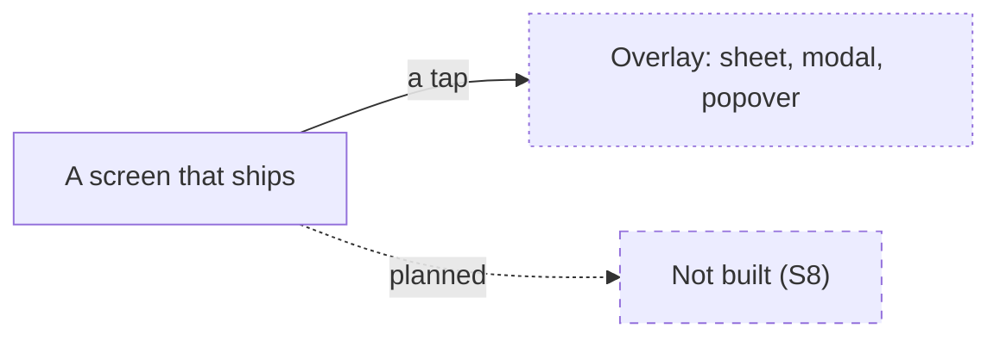

- **Solid box** — built and deployed.
- **Dashed box** — planned, with the slice that owns it.
- **Dotted box** — an overlay rather than a route: it has no address of its own unless the label
  says otherwise.
- **Solid arrow** — a real navigation. **Dotted arrow** — planned.

---

## 1. The map

Everything reachable from a signed-in session. Below `md` (768px) the four roots live in the bottom
bar; above it they are sidebar rows.

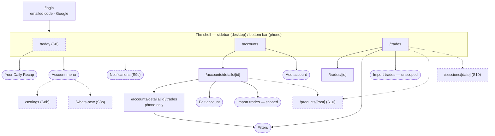

**`/today` exists but is not linked yet.** The shell's `Today` row still points at a 404: the page
is reachable by address only while its read is a fixture, which is the containment rather than a
"sample" banner on the page itself (`today/page.tsx` argues it). `S8` links it when the nightly job
lands.

**`Read` came out of the nav on 2026-08-31** (`spec.md` §4, amended). The daily read ships as a card
on `Today` instead, the way Monarch's Weekly Recap is a dashboard widget rather than a room. The
page is deferred, not cancelled. **The code still renders a fourth `Read` row pointing at a 404** -
removing it is the first thing the recap slice does.

`/settings` and `/whats-new` were *unplanned* rather than unbuilt until 2026-08-20; `S8b` claims
them, and until it lands the sidebar's gear ships `disabled` rather than pointing at nothing.

---

## 2. What Back does, and it is the same rule everywhere

Stated first because it is the rule most often broken, and because a phone has a Back button
whether or not a screen was designed for one.

> **Every screen has a visible way out, and the device Back button does exactly what that control
> does. The only place Back leaves the app is one of the four roots.**

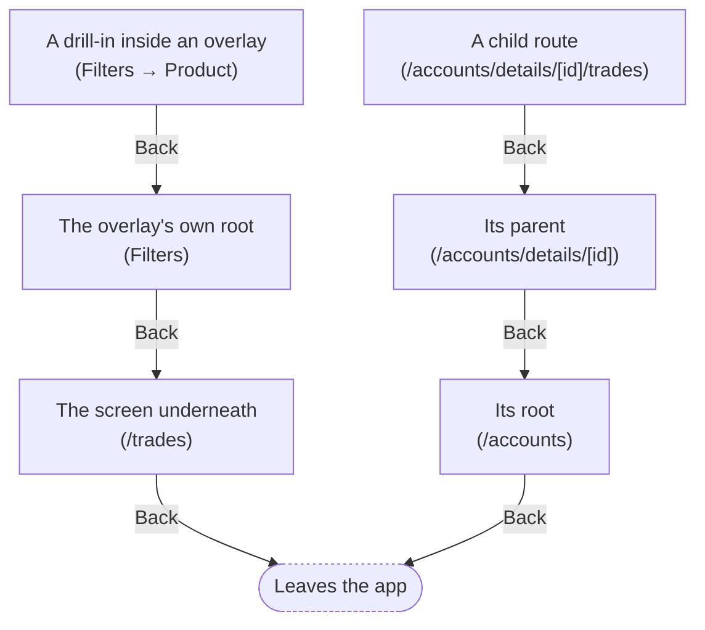

**The roots are `/today`, `/accounts` and `/trades`** (three since 2026-08-31, when `Read` left the
nav). Back there minimises the browser, which is what a native app does and what a trader expects.
Anywhere else, Back is an in-app step — including the recap, which is an overlay on `Today` and
answers Back by closing.

**How it is implemented:** `useOverlayBack` (`src/lib/overlay-back.ts`). One history entry per
overlay LEVEL, pushed by the tap that opened that level, ordered by a module-level token array —
never by `history.state`, which Next copies forward onto neighbouring entries.

**Two rules that are load-bearing and were each learned the hard way:**

1. **An entry is pushed by a tap, never inside a `popstate` handler.** Chromium's history
   manipulation intervention discards an entry added with no user gesture behind it, *without firing
   `popstate`* — so a re-armed entry is silently skipped and the next Back walks out of the app.
   That is exactly what "the back button minimizes the entire chrome app" was.
   ([Chromium docs](https://chromium.googlesource.com/chromium/src/+/main/docs/history_manipulation_intervention.md))
2. **An overlay that COMMITS a navigation calls `markReplacing()`**, or its cleanup's
   `history.back()` reverts the write — inside one React commit every effect cleanup runs before
   anything else.

Both are in `scar-tissue.md` with the bug each one produced.

---

## 3. Signing in

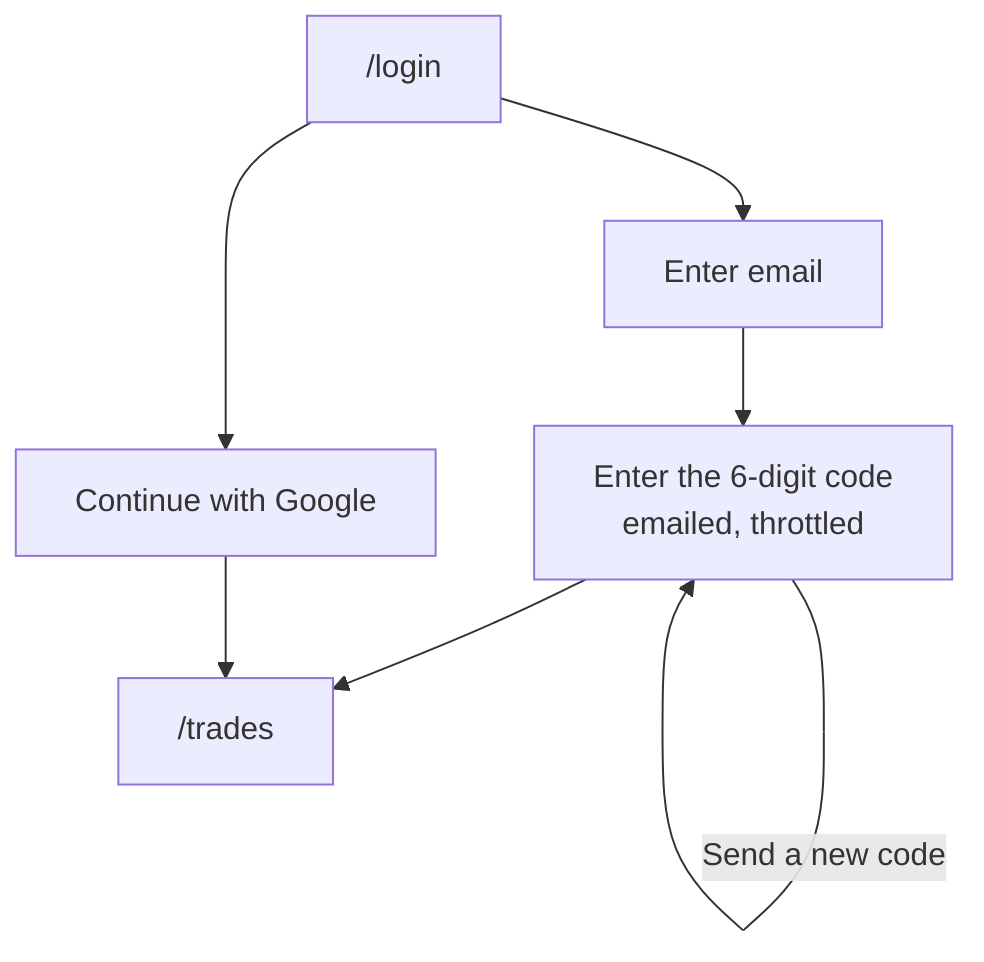

**An emailed code, not a magic link**, and the send throttle lives in Better Auth's `before` hook
rather than in `sendVerificationOTP`. `?next=` is attacker-supplied and always read through
`safeNext`.

---

## 4. Accounts

### 4a. The roster

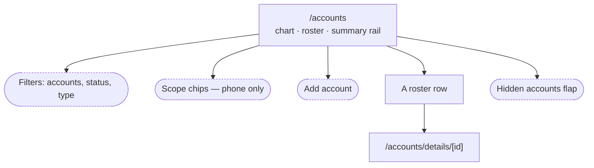

The roster never filters hidden accounts out in SQL — they sit in a disclosure flap, so a hidden
account is one tap from being un-hidden. An empty roster says *"No accounts yet"*; a roster a filter
emptied says *"No accounts match"*, which is a different sentence.

### 4b. Adding an account

Two doors, one level down, and a third that is deliberately dark.

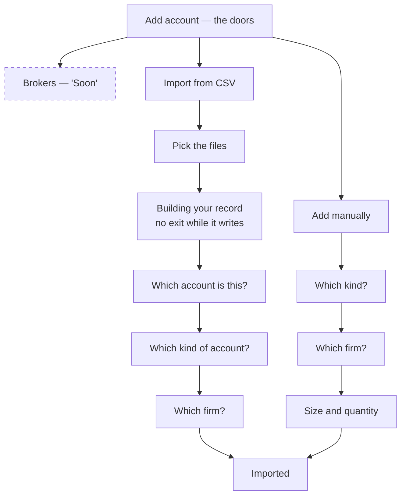

**The doors belong to `Add account`, and only while there is a choice to make.** Every import opener
skips them today: `TRADOVATE_CONNECT_LIVE` is false, so CSV is the one live source and a chooser with
one option is a speed bump rather than a question. Flip that constant and they return on every import
opener at once. The roster's `Add account` keeps them at all times — that is a different job, and the
dark Brokers row is a destination signal there rather than an option.

**Three openers, and one of them behaves differently.** `Add account` on the roster and `Import` on
the tape are UNSCOPED: the accounts are resolved from the files alone. `Import trades` on an
account's own page is SCOPED to that account, which is the trader asserting the files belong to that
row — the only assertion allowed to fill in a hand-added placeholder. The scoped opener drops the
`Add manually` door, because you cannot add an account you are standing on.

**Brokers leads even though it is dark**, because it is the answer most traders want and the row
says "Soon" rather than pretending. **Cash History is required on import, not optional** — the Fills
export's `commission` column measures 42% of true cost.

On a phone every one of these is a full-screen sheet, and the header renaming is what makes a screen
slide up as its own layer. **While a write is in flight the header shows no exit and the device Back
button is spent rather than obeyed.**

### 4c. One account

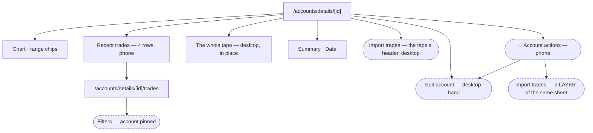

**The import sits in the tape card's own header on a desktop**, which is the row of controls
belonging to the table it fills. Below `md` there is no such row — `Recent Trades` carries a
caption, not a toolbar — so **the phone's bar carries a `⋯` instead**, opening a sheet with Edit
account and Import trades. Either way it is scoped to this account.

**Import is a LAYER of that sheet, not a second one.** Tapping it slides the upload step up over the
action list and renames the bar, which is §6a's rule for a screen you arrived at. The naive build —
a menu whose rows call the existing openers — slides this sheet down while another slides up, two
full-screen surfaces crossing for one tap. **Edit does hand off**, because its form owns three
screens and its own confirmations; that is the one row that costs a crossing, and it is the rare one.

**The Data card's link is first-run only now, at both widths.** It survives where it earns its place
— directly under a "Last import: Never" it answers — and the recurring "Add more" variant is gone,
since the bar reaches the same action in one tap from the top rather than 1301px down the scroll.

**`/accounts/details/[id]/trades` is phone-only and redirects to the parent above `md`** — nobody
navigates there on a desktop, since the button that leads to it is `md:hidden`, so what the redirect
covers is a pasted link. It is a route rather than a client-state layer because **search and the
filter write to the URL**: as a layer they would narrow the details page's own address with no
control left to clear it.

The account is **pinned** in that screen's filter sheet — shown as a chip with the firm's mark and
no `x`, so the Accounts axis states which account the tape is about rather than offering to change
it.

### 4d. Editing an account

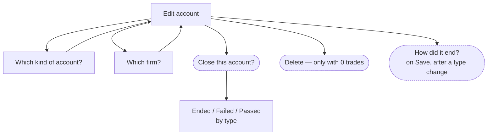

**Type and Firm are rows you can change, not screens you must pass through** — position is its own
state, so `type` only ever holds an answer and Back never has to erase one.

**The type and the status travel together.** `account_type_status_check` pairs them, so changing the
type of an account that has already ended asks for the ending again, in a modal of its own, on Save.
Relabelling as Personal has one possible ending, so it is taken rather than asked for.

| type | may be | asked as |
|---|---|---|
| unlabelled | `active` only | — |
| evaluation | active · passed · failed | Passed / Failed |
| sim_funded | active · failed · closed | Ended / Failed |
| personal | active · closed | not asked |

**A trade is never editable and the option is not offered.** A quarantined trade gets re-sync or
exclude-with-a-reason; neither writes to the trade, and an excluded trade stays visible and
countable.

---

## 5. Trades

### 5a. The tape

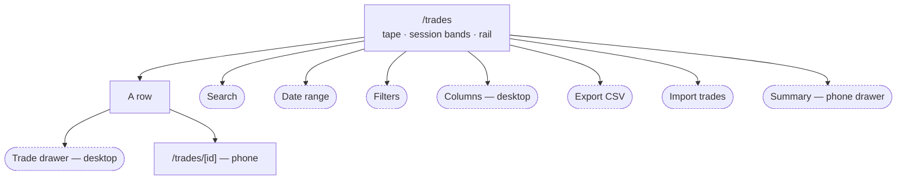

**Import is the only control here that ADDS.** Search, Date, Filters and Columns all narrow what is
already in the tape; before this the page had four ways to hide trades and none to fill it, and its
empty state gave an instruction with nothing to press. It is UNSCOPED — `/trades` spans accounts, so
there is no row to assert against and the files decide. See `spec.md` `S1`, amended 2026-09-02.

**`/trades/[id]` is a real route and an overlay at the same time.** Tapping a row pushes the address
without unmounting the tape — the row's data is already in hand, so there is no fetch and no loading
state. Opened cold, the same address renders server-side.

### 5b. The filters, and where the two surfaces diverge

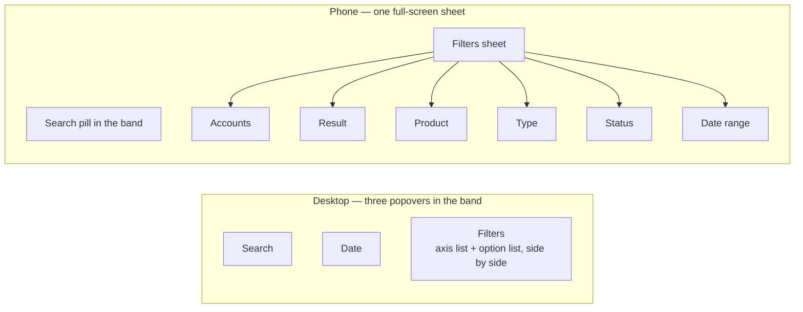

**Five axes, and every one is counted against the other four.** An axis is never narrowed against
itself, so a second product stays addable after the first is picked, and `MNQ` reads its real count
while `MNQ` is ticked. An option with nothing to reach is **shown, greyed, and unpressable, with its
`0` beside it** — on both surfaces. It is not hidden: a row that vanishes as you tick makes the list
jump under your thumb and leaves a product you know you traded simply missing.

`facetCounts()` in `src/lib/trades/facets.ts` is the one implementation. Status and Type are
properties of the *account*, so they are counted in accounts — "Failed 1" is one account.

**Result is a choice of one.** Wins and losses together is every trade, so both ticked narrows
nothing while claiming a `2` on the badge. Every other axis is multi-select.

---

## 5c. Subject pages — `S10`, held behind `S7`

**Not a new kind of page. The page Run already has, with a subject pinned.** `/accounts` is chart +
breakdown + rail; `/accounts/details/[id]` is that page with one account pinned. `S10` adds two more
things that can be pinned, and one idea that makes pinning worth having.

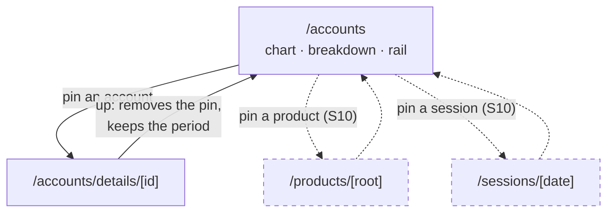

**The chart is the navigation.** `S10`'s phase A makes each bar a button: the range chip says which
bars exist, and clicking one says which you are reading. The selected bucket goes in the URL, and
everything under the chart is scoped to it. That is what `PeriodHeading` has been waiting for - a
window has no "August" to name, and a selection does.

**Going up removes the pin rather than going back**, and it keeps the period you had selected. So
Back from a pinned page is an in-app step like any other (§2), and the address it lands on is the
same screen minus one filter.

**Three doors in**, and the third is the one to get right:

1. the breakdown row, once it can group by product;
2. the instrument name in the trade detail;
3. **the trade drawer's own link**, which states its count: **"View 47 MNQ trades"** rather than the
   name made clickable. Monarch's version reads "View 16 transactions" and sits on its own line under
   the merchant - it says how much is on the other side before the tap.

Keyed on the product ROOT, never the contract month: `MNQ`, not `MNQU6`. Full reasoning, the
research it came from and what deliberately is not copied: `build-plan.md` §S10.

---

## 5d. Today — the front door

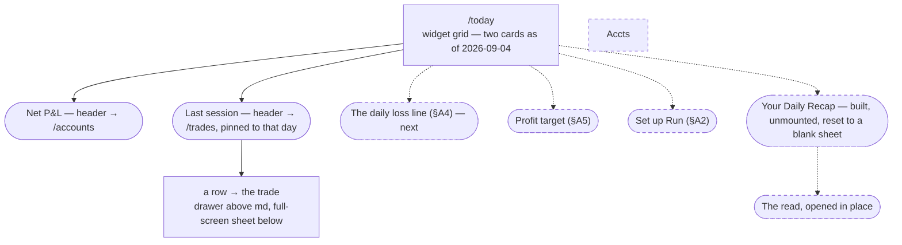

**`Last session` is the second card, built 2026-09-04**, and it is the first thing on this page a
trader can open something FROM. Two doors, and the width picks between them at the moment of the tap
exactly as `/trades` does: **a drawer above `md`, a full-screen sheet below it**. The sheet takes
`/trades/<id>` into the address itself, so **Back closes it** rather than leaving the page; the
drawer closes on `Escape` and on its own `x`. The header is the third door - `/trades` pinned to that
session's date, carrying the account scope when the page is narrowed.

**It draws the row's two-column form at every width** (instrument and result, no account column and
no clock), which is not a phone concession: a half-width dashboard card is 376px at a 1024 viewport
and never clears 560 below about 1400, so the four-column tape row cannot fit one. The account and
the entry time are on the row the trader taps. `monarch-dashboard-teardown.md` §3.9 carries the
measurement and the reference's own precedent.

**The widget contract**, ported from the reference and confirmed in its markup: the **title is the
link** (the whole header block, not a chevron beside it), the **period sits with the title**, the
scope control is a small combobox *inside* the widget, and the body is a chart, a list, or an empty
state with a **specific** CTA.

**No widget paginates.** Zero previous/next controls exist on the reference's whole dashboard, and
the reason is structural: a dashboard's claim is *at a glance*. Browsing through time is a page's
job. `build-plan.md` §S8 records what that would take.

**The band carries the GREETING, and the account scope sits beside it** *(2026-09-03, restoring
2026-08-31 and reversing 2026-09-01)*. It ran for one day, was replaced by the word `Today`, and is
back on Luke's call: *"we did have the greeting in the header like monarch does it. that was a fully
coded implementation... we need it back and it needs to be the code we had before because i did
research to find out exactly how to code the greeting to make it work properly."* Restored with
`git show` from `aa4522e` rather than retyped - `hourIn`'s three measured `Intl` failure modes are
the valuable part, and re-deriving them is how one comes back. `/today` is again the one route the
shell renders no title for (`SELF_TITLED`), or the band would print both.

**To its right, in the header's controls cell, is the page-level account scope.** One picker, writing
`?accounts=<uuid>`, and every card on the page reads it - so three widgets can never describe three
different sets of accounts. It is `AccountSelect`, the same control `/trades` draws, so the labels
and the param are shared. `Customize` is deliberately absent (`monarch-dashboard-teardown.md` §A8).

**The `<h1>` interlude is over.** For two days the shell titled this page like the other two, which
was the consistency Luke asked for on 2026-09-01 and is not what the reference does: its dashboard
carries no heading element at all. The trade-off is stated rather than hidden - `/today`'s band no
longer matches `/accounts` and `/trades` in markup, and that is the point of a front door.

**The recap card is unmounted for the beta** *(2026-09-03)* — no nightly job, so a card on a fixture
cannot ship. The three cards that replace it, their controls and their order are argued in
`monarch-dashboard-teardown.md` §4. `/read` is a placeholder page rather than a 404 since the same day.

**Back on `/today` exits the app** — it is a root. The recap's overlay is an in-app step and closes.

---

## 6. The daily recap — a card on `Today`, and `S7` behind it

**Amended 2026-08-31: this was `/read`, a nav row.** It is now `Your Daily Recap`, a widget on
`Today` that opens in place — Monarch's own arrangement for the surface this is ported from. What
the read SAYS is unchanged; where it lives is not. `spec.md` §4 carries the reasoning.

**What ships with `S8`:** the card and what it opens — one day's read, the trades it cites, the
trust note, and an empty state that says what would let it find something.

**What is still blocked on [#2](https://github.com/modryn-studio/run-rebuild/issues/2):** History,
and everything that needs a tracked claim behind it. Decided 2026-08-31 that the READING wins for
v1 — prose per day, no pattern object — but the tracking is deferred rather than dropped, and the
one irreversible piece is capture: the engine's rejected candidates cannot be reconstructed later,
so the nightly job stores them from day one whether or not anything ever reads them.

### The page that was specced, kept for when it earns a room

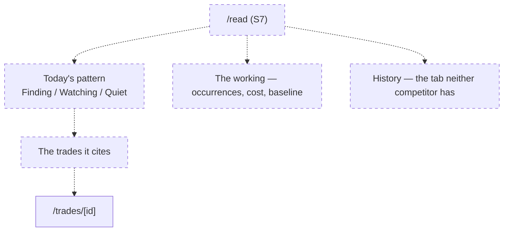

**The engine exists and its output does not fit the spec.** The proven pipeline produces a *reading*
— one subject, this tape, now. The spec is built on a *pattern* — named, counted, priced, tracked
across months. Both are defensible; v1 specifies one and has an engine for the other, and that is a
phase 2 decision. Nothing downstream should assume either shape won.
See `build-plan.md` §S7 and [#2](https://github.com/modryn-studio/run-rebuild/issues/2).

**The LLM never computes a number.** It receives finished figures and writes the sentence around
them; every number in a read comes from SQL.

---

## 7. Today — `S8`

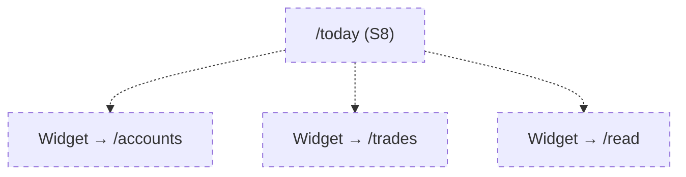

**Last on purpose**, because every widget links to a page that must already exist. **No state may
represent absence** — no "you haven't imported in 9 days", no backlog, no streak. Today is the
surface most likely to break that rule, and it reopens where the trader left it.

---

## 8. Settings, What's new, Notifications — `S8b` and `S9c`

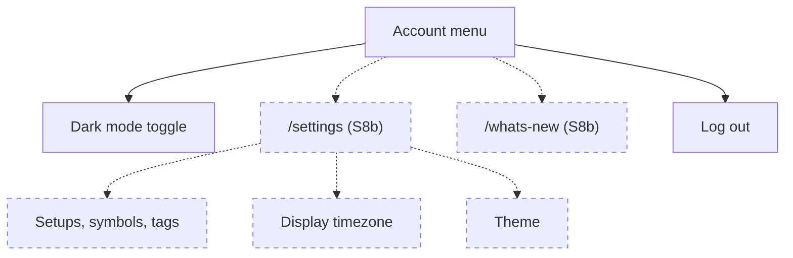

> ⚠️ `trader.display_timezone` is **display only** and must never reach the bucketing code. A
> settings screen is exactly where that rule gets broken, because a timezone control looks like it
> should change what a session date means. It must not.

**What Run could ever notify about** is narrow, because the doctrine rules out most of what a
finance app uses notifications for: an import that finished while the trader was away, a trade that
quarantined, the daily read being ready. All three are *events that happened*, never *reminders that
something did not*. If the list cannot be filled without reaching for absence, the honest outcome is
that Run has no notification centre.

---

## 9. Internal surfaces

| Route | What it is | Who reaches it |
|---|---|---|
| `/kitchen-sink` | Every primitive in every state, with the token proofs | Anyone building |
| `/kitchen-sink/demo` | Scenes for capture — the upload flow, the sheets | Media only |
| `/status` | One query at request time, plus the deployed SHA | The release gate |
| `/admin` | Analytics events and signups | Admins only; 404s otherwise |

`layout.tsx` sets `robots: { index: false }` across the app. Remove it when the project genuinely
goes public.

---

## 10. Route inventory

| Route | Slice | State |
|---|---|---|
| `/` | S0 | ships — the door |
| `/login` | S3a | ships |
| `/today` | **S8** | **two cards live** — `Net P&L` (2026-09-03) and `Last session` (2026-09-04) |
| `/accounts` | S6 | ships |
| `/accounts/details/[id]` | S6 | ships |
| `/accounts/details/[id]/trades` | S6 | ships — phone only, redirects above `md` |
| `/trades` | S5 · S5d | ships |
| `/trades/[id]` | S5d | ships — route and overlay |
| `/read` | — | **removed from the nav 2026-08-31.** The read is a card on `/today`; the page is deferred. See §6 |
| `/products/[root]` | **S10** | **not built** — held behind S7, see §5c |
| `/sessions/[date]` | **S10** | **not built** — held behind S7, see §5c |
| `/settings` | **S8b** | **not built** |
| `/whats-new` | **S8b** | **not built** |
| `/status` · `/admin` · `/kitchen-sink` | S0 · S3c | ship — internal |

**API routes:** `/api/accounts` (label · create · close · delete) · `/api/csv-import` ·
`/api/trades/page` · `/api/trades/export` · `/api/trader/timezone` · `/api/track` ·
`/api/auth/[...all]`.

---

## Keeping this current

**It is owned like code.** A slice that adds a route, an overlay level or a Back path changes this
file in the same commit — the same rule `CLAUDE.md` states for itself. A diagram that disagrees with
the app is worse than no diagram, because the next reader believes it.

When a dashed node ships, it loses its dash and its slice tag in the same change that closes the
slice.
